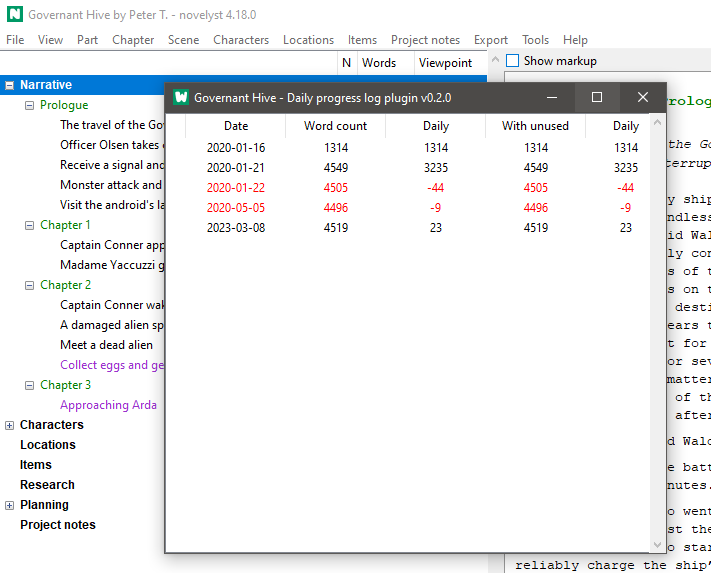

# noveltree_progress

The [noveltree](https://peter88213.github.io/noveltree/) Python program helps authors organize novels.  

*nv_progress* is a plugin providing a daily progress log viewer. 

## Features

- Display a list of daily word count log entries.

## Requirements

- [noveltree](https://peter88213.github.io/noveltree/) version 1.0+

## Download and install

[Download the latest release (version 1.0.1)](https://github.com/peter88213/noveltree_progress/raw/main/dist/nv_progress_v1.0.1.zip)

- Extract the "nv_progress_v1.0.1" folder from the downloaded zipfile "nv_progress_v1.0.1.zip".
- Move into this new folder and launch **setup.pyw**. This installs the plugin for the local user.

---

[Changelog](changelog)

## Usage

See the [instructions for use](usage)

## License

This is Open Source software, and the *nv_progress* plugin is licensed under GPLv3. See the
[GNU General Public License website](https://www.gnu.org/licenses/gpl-3.0.en.html) for more
details, or consult the [LICENSE](https://github.com/peter88213/noveltree_progress/blob/main/LICENSE) file.
